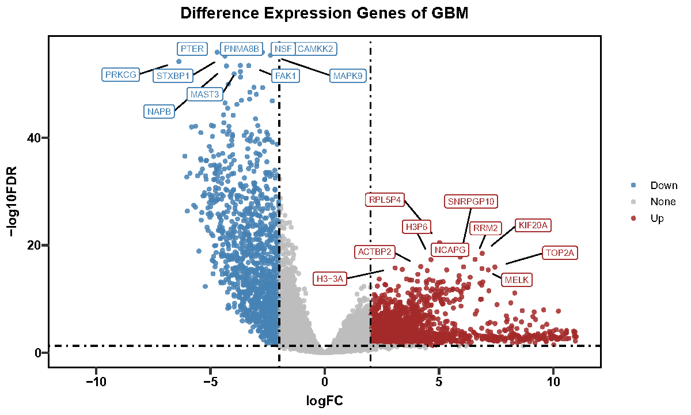
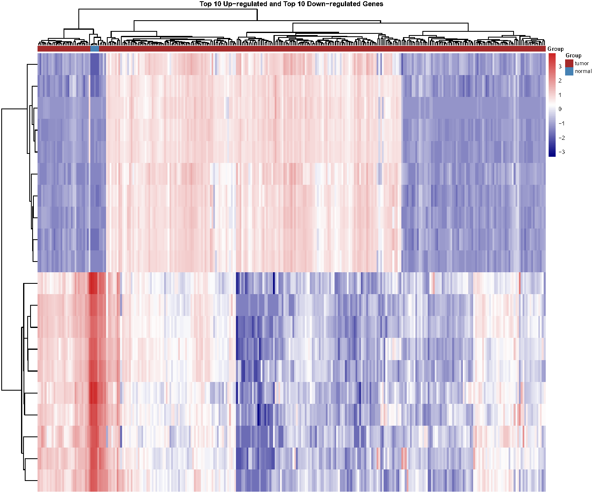

# TCGA数据处理与差异分析
## 主要文件包含：
1. 🗃️Difference_Analysis.Rproj
2. 📄Count&Tpm.R
3. 📄Difference_Analysis.R
4. 📁./Data/
---
> 由于Github上传大小限制，在执行程序之前，请将[数据源文件](https://github.com/Data708983/Difference_Analysis/releases/download/source/gdc_download_20260315_132413.267760.tar.gz)下载后放入./Data/文件夹中

> 本项目参考了[TCGA 差异表达分析及可视化](https://blog.csdn.net/swangee/article/details/141646920)博客内容

> 🗃️Difference_Analysis.Rproj为项目文件，请依次执行：
> - 📄Count&Tpm.R
> - 📄Difference_Analysis.R

> 你将在📁./Processed/文件夹中获得：
> - 分析数据以及🌋火山图pdf

